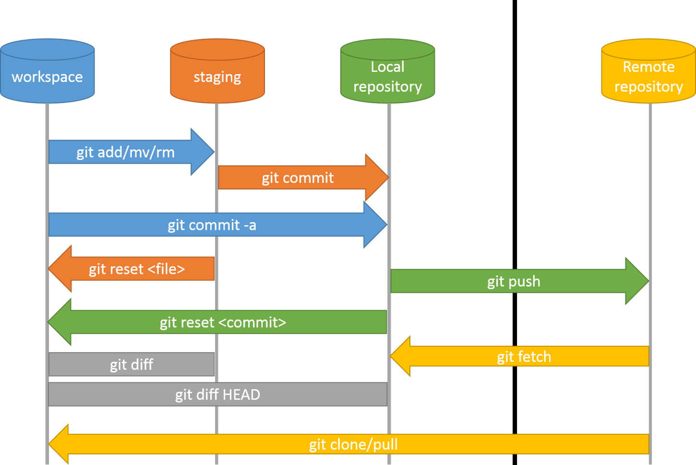

## 연주팀 Git 개발문화 만들어가기 Project
* 이 글에는 검색엔진에서 찾은 이미지가 첨부되어 저작권 문제가 있을 수 있으니 열람만 하시되 공유 배포 되어서는 안됩니다.
> 연주팀에서 Project Developer(PD) 업무를 맡고 있는 이성훈 입니다. 저희가 진행중인 프로젝트에서 사용하는 형상관리 툴인 git 활용능력을 높여 생산성을 올릴 필요가 있다 생각되어 git 개발문화를 함께 만들어갔으면 하는 취지로 이 글을 작성합니다.

* #### 들어가며...
> git은 진입장벽이 있는 형상관리 툴입니다.(저는 아직도 git이 어려워요..) 제가 github를 처음 썼을때는 `구글 드라이브가 더 편한데 왜 이걸 써?` 라는 생각도 했고 협업 방식에 대해서는 1도 모르는 상태에서 github를 원격 저장소 개념으로만 사용하곤 했습니다. svn같은 다른 소스버전관리 시스템을 접하였다 하더라도 git을 처음 접하면 로컬과 리모트 저장소의 개념이 헷갈리거나 필요성을 못 느낄 가능성이 큽니다. 개인적으론 git에 대해서는 학습이 필수적이라 생각합니다만 그동안 얘기하지 못한 사정은 다음과 같습니다.

* `개발하기도 바쁜데 뭐하러 그런걸 해?` 당장 git을 사용해서 협업을 해야하는데 학습이 필요하다고 하면 개발자들의 거부감이 생길 수 있음.
* `심플한게 답이다!` 정보가 불충분하게 전달되어 학습이 부족한 상태로 git을 마구잡이로 사용하는 경우가 발생할 우려.

> 사실 이 글을 쓰는 도중에도 이 내용이 넥스트리에서 컨설팅 하는 내용과 겹치는 부분이 있지않을까 하는 우려에 괜한 시간낭비를 하는게 아닐까라는 생각도 듭니다. 하지만 팀 내에서 올바른 개발문화를 만들어가는 것은 누군가가 코칭해주는게 아닌 자발적, 능동적 참여가 필요하다 생각합니다. 이 글은 제가 git을 사용하면서 헷갈렸던 개념과 용어들 그리고 협업방식 경험들을 `글로 녹여내려가는 과정`(프로젝트성 히스토리)과 팀원들의 `추상적 사고`를 도와주기 위한 글이 함께 포함될 것입니다. 모쪼록 도움이 되셨으면 합니다.  

---

### `전달하고자 하는 Context 도출하기` (History 2019-05-24 작성)
* #### 브레인 스토밍
    * 깃 기본, 깃 인프라스트럭쳐 이해, stage, clone, pull, fetch, master, branch, origin, pipeline, ci/cd, merge, conflict, base branch, HEAD, work flow, git log, resolve, git flow, pull request, merge request, feature branch, release branch, hotfix branch, source tree, tortoriseGit, issue board, todo list

### `전달할 정보의 순서 정하기(구조화)` (History 2019-05-24 작성)
1. 대주제 이름 짓기
    * 대주제(Title) : git 협업을 위한 학습여정
2. 중주제 나누기
    * 중주제(Chapter) : 버전관리시스템, git 기본, git 구조 이해, git 명령어/용어 의미 추상화하기, 협업을 위한 branch 전략
3. 소주제 구상 생략. description을 적으면서 동적으로 생성.
    * 소주제(Section) : 블라블라

### `글 쓰기`

---

## git 협업을 위한 학습여정

### 버전관리시스템(Version Control System) (History 2019-05-24 작성)
* 중앙 집중형(대표s/w : `SVN`) : 서버가 장애가 생기면 협업 불가능 / 복구 문제
* 분산 서버형(대표s/w : `Git`) : 각 클라이언트가 저장소를 가지고 있고 서버가 날라가도 작업이 가능, 복구가 가능. 이외에도 commit에 대한 다양한 workflow 구현 가능.
* 특징
    * git은 상태의 순간 `snapshot을 저장`한다.
    * 파일을 파일명이 아니라 SHA-1 `해쉬 값으로 저장`.

#### Git Basic - 깃 기본 (History 2019-05-24 작성)
* 기존 디렉토리를 Git 저장소로 만들기
```
git init
```
* 리모트 저장소를 복제해오기
```
git clone https://github.com/libgit2/libgit2
```
* 파일 상태 확인하기
```
git status
```
* 파일을 추적하기 - stage 하기 '`커밋 준비 단계`'
```
git add file.txt    --단일 파일 stage
git add .           --현재 디렉토리 기준
```
* 변경사항 커밋하기  '`현재 상태를 사진 찍습니다`'
```
git commit -m "커밋메세지"    --커밋메세지는 사진작품의 제목
```
* 리모트 저장소로 push하기
```
git push -u origin master    --최초 push할 때 사용
git push origin master       --origin의 master 브렌치에 push할 것을 명시
git push                     --config 정보에 따라 push
```
* 리모트 저장소를 pull하거나 fetch하기
```
git fetch <remote>
git pull <remote>
```
* 브렌치 목록보기,생성하기
```
git branch               --브렌치 목록보기
git branch <브렌치명>    --브렌치 생성하기
```
* 브렌치 전환하기(HEAD 바꾸기)
```
git checkout <브렌치명>
git checkout <commit해쉬값>
```
* Merge
```
git merge <병합할브렌치>    --병합할 때 base 브렌치는 현재 checkout 되어있는 브렌치가 된다
```

#### git 구조 이해 (History 2019-05-25 작성)

* 우선적으로 다음 그림은 반드시 이해하고 넘어갈 것을 권장합니다  


* 명령어와 같이 보면 이렇습니다
    * working directory : 내 컴퓨터의 폴더
    * staging area : 커밋 대기 상태 영역
    * local repo : git의 로컬 저장소. 커밋하면 스냅샷으로 해쉬값을 .git에 저장합니다
    * remote repo : 원격 저장소입니다. 이것도 역시 폴더  


* 조금 더 디테일한 그림에선 이렇게 표현합니다    


* staging area라는 말은 언제부터 생긴지 모르겠는데 index가 좀 더 정확한 표현이다  

#### CI/CD 이해 (History 2019-05-25 작성)
* Continous Integration(지속 통합) / Continuous Delivery(지속 배포) : CI/CD는 아래 그림에서 보듯이 `코드를 push 한 이후(원격 저장소)`부터 빌드/테스트/통합/배포 의 주기에 있는 프로세스를 자동화하여 애플리케이션을 더욱 짧은 주기로 고객에게 제공하는 방법을 말합니다. 이런 제공 및 배포에 이르는 애플리케이션의 라이프사이클 전체에 걸친 프로세스를 자동화하고 모니터링을 제공하는 것을 `CI/CD 파이프라인`이라 부릅니다. 


#### git 명령어/용어 의미 추상화하기
* git push `origin` master
    * `origin`은 원격저장소의 별명일 뿐 아무런 의미도 없습니다. `master`도 역시 최초 생성시 base branch를 부르는 별칭일뿐 그 안에 내포된 의미 같은것이 없습니다.  
    
    

* `git commit`
    * commit을 표현 할때 snapshot이란 용어를 보통 쓰는데 이해를 돕기 위해 타임캡슐 혹은 사진을 찍는 개념으로 추상화 시키면 이해가 쉽습니다.  
      
    * gui 형상관리 툴에서 git log에서 표현하는 history 내역을 보면 snapshot이 동그라미로 표현되는데 이 경우 모양을 빗대어 타임캡슐로 표현하면 재밌게 이해할 수 있을것 같습니다.  
      

* `push 할 때 -u 옵션`
    * 최초 push를 진행하는 경우 -u 옵션을 사용한다 왜 그럴까요? -u 옵션은 upstream의 의미로 로컬 브렌치와 원격 브렌치의 다리 or pipe를 놓아준다고 이해하면 됩니다.(실제 물리적으론 config에 정보가 추가되는 정도에 불과하지만...)  
      

* `git clone`
    * clone은 말 그대로 복제라는 의미입니다  
    
    * clone으로 프로젝트를 받게 되면 upstream도 자동 설정 됩니다  

* `git stash`
    * stash는 감추다 라는 의미를 가지는데요. git stash 명령어는 작업 도중 스택에 잠시 저장할 수 있도록 하는 명령어입니다. 하던 작업을 임시로 stash해두고 나중에 꺼내와 작업하는 것입니다.  
    

* `git checkout`
    * git checkout은 HEAD의 이동입니다.  
      
    * git bash를 보면 현재 어떤 branch인지 확인 가능합니다  
    

* `git merge`
    * merge를 할땐 항상 base가 되는 브렌치에서 명령어를 실행하시길 권장합니다.  
      

* `fetch` vs `pull`
    * fetch와 pull의 차이점은 위에서 git 구조를 이해하셨다면 어느정도 알고 계실겁니다. 다음 그림을 통해 차이점을 좀 더 명확하게 살펴보고 이해하면 좋을듯 합니다.  
    

* `conflict`
    * 병합을 수행하다보면 conflict 나는 경우를 종종 볼 수 있습니다. 이 경우 conflict가 났다라고 하는데 같은 파일에서 같은 Line의 코드를 수정했을 때 발생한다. git 시스템이 '어떤게 최신 소스코드이죠?' 라고 질문하는 듯한 느낌으로 이해하면 됩니다.  
    

* `rejected`
    * history가 리모트 저장소와 맞지 않을 때 push를 진행하다 보면 rejected 문구가 나오면서 push를 거부합니다. 상대방에게 push하려면 다시 history를 맞춰서 push하길 바랍니다.  
    

* `-f 옵션` --force
    * force 옵션은 무언가 강제로 진행할 때 사용하는 옵션으로 협업을 할 때 사용을 제한하는 편입니다. 만약 사용을 해야된다면 팀원들에게 그 사실을 알리고 추후에 발생할 문제에 대해 깊이 고민해보고 시도해야 합니다.  
    

* `revert` vs `reset`
    * `revert`는 우리가 느끼기엔 한단계 이전으로 돌아간 것처럼 보이지만, 내부적으론 새로운 snapshot이 추가된 것을 확인할 수 있습니다. 이것은 rollback한 이력이 보이기 때문에 협업할때 필수적이고 안전한 방법입니다.
    * `reset`은 한단계 이전으로 돌아가지만 현재 작업하는 snapshot을 포기하는 것입니다. 명령어에서 --hard 옵션이 들어가는 것만 봐도 느낌이 오지 않으십니까? 네 협업할땐 사용하지 말아야 할 매우매우 위험한 명령어입니다.  
    

* reset 옵션 : `--hard --soft --mixed`
    * reset 관련 옵션으로 쓰이는 것들은 저도 자주 사용해 본적이 없어서 잘 모릅니다. 하지만 눈에 잘 들어오게 설명이 잘된 다음 그림을 보시면 이해가 되실겁니다. 우리가 하는 협업에서는 reset 명령어는 되도록 사용하지 말아야 합니다.  
    

* 추가되었으면 하는 명령어나 용어가 필요하시면 피드백 주시면 감사하겠습니다

#### 협업을 위한 branch 전략
* branch 전략은 논의가 필요한 부분입니다. 앞선 git 관련 사전지식들이 어느정도 뒷받침 된 상태에서 팀 내부적으로 전략을 어떤 것으로 정할지에 대해서 논의가 이루어졌으면 합니다. 이미 앞선 사례들로 좋은 branch 전략들이 있으니 저희는 팀에 맞는 branch 전략을 선택하거나 best practice 사례를 한번 보시고 전략을 구상했으면 좋겠습니다.

* 대표 git-flow 전략 이미지  
  

    * `master` : 제품으로 출시될 수 있는 브랜치
    * `develop` : 다음 출시 버전을 개발하는 브랜치
    * `feature` : 기능을 개발하는 브랜치
    * `release` : 이번 출시 버전을 준비하는 브랜치
    * `hotfix` : 출시 버전에서 발생한 버그를 수정 하는 브랜치
* 좀 더 자세한 내용으로 각 브렌치들을 살펴보겠습니다.    
    * master 브렌치는 CI/CD가 참고하고 서비스가 지속배포 되고 있을 경우 서비스에 장애가 없는 완전무결성을 유지해야 합니다.
    * develop 브렌치는 master 브렌치에서 복제되어 치명적인 결함이 없는 상태의 무결성을 유지합니다.
    * feature 브렌치는 기능추가를 위한 작업이 필요한 경우 develop 브렌치에서 복제해와서 기능추가를 위한 작업을 실행하는 브렌치입니다.
    * release 브렌치는 develop 브렌치의 작업물이 빌드, 테스트 과정을 거쳐 결함이 없는 상태를 만들어 출시할 버전을 준비하는 브렌치입니다
    * hotfix 브렌치는 release 브렌치에서 생각지 못한 버그를 수정하는 브렌치입니다.

* 현재 github에서 관리되는 react 같은 인기 있는 오픈소스 기술은 realease가 정말 활발하게 이뤄지고 엄청나게 많은 사람들이 협업해 나가는 방식을 선호합니다. 이런 프로젝트들을 관심있게 살펴보면 협업하는 방식을 배우기에 아주 좋은 학습자료가 됩니다.  


* `Release branching 전략(1안)`  


* `심플한 branching 전략(2안)`  


* `위 전략에서 조금 확장된 형태(3안)`  


> 그러나 현실적으로 위 사례들을 참고해서 branch 전략을 바로 적용하기엔 어려움이 있다고 생각됩니다. 그래서 팀에 맞게 처음 시작은 조금 더 단순하게 시도하고 서서히 디테일한 branch 전략을 세우는게 더 좋다고 생각합니다.


> pull request도 다뤄야 하는데 이건 다음에.... 정리해서 올리겠습니다. 방법이 여러가지 있으나 처음 시작할땐 최신 상태의 브런치를 내 작업 브런치와 먼저 로컬에서 병합하고 conflict나는 부분을 해결해서 push 하는 방식으로 하는게 좋고... 나중에 rebase를 활용한 방법도 있지만 이거는 조금 숙련되면 시도하는걸로 하는게 좋습니다.


